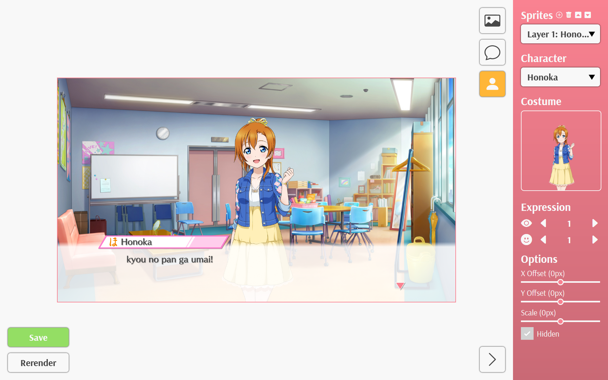
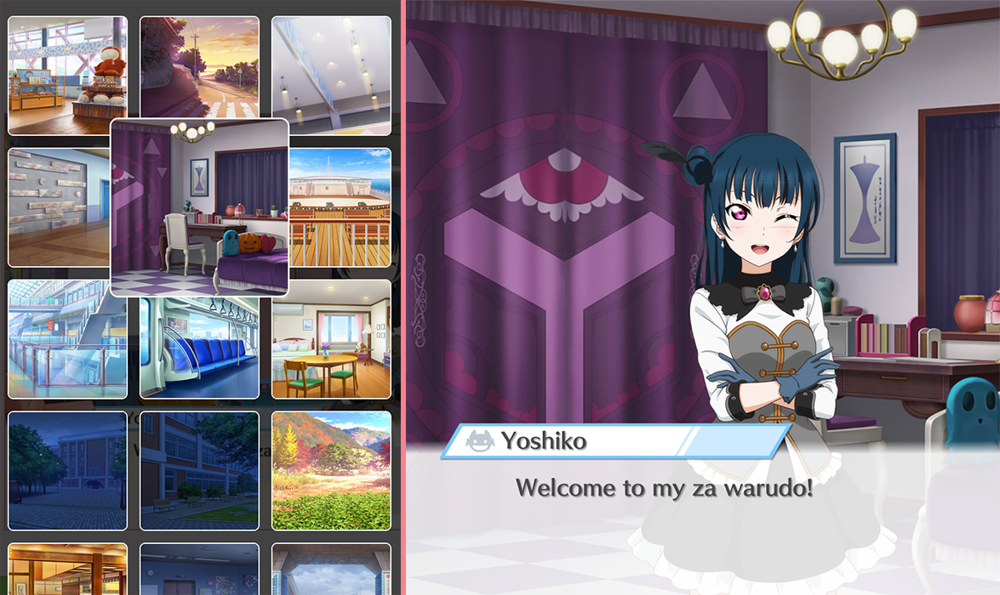
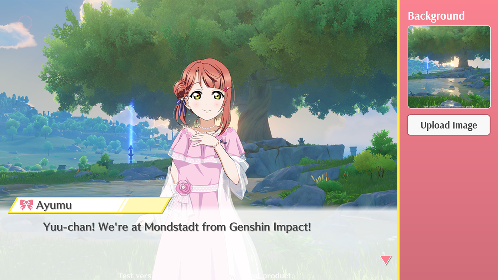
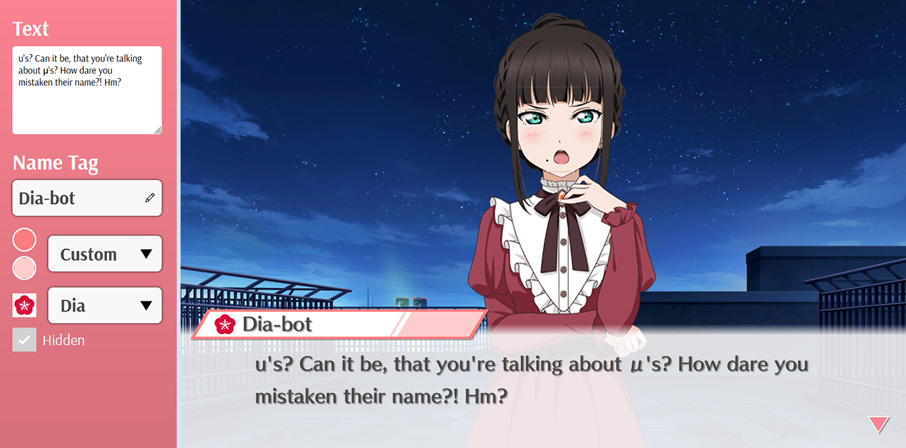
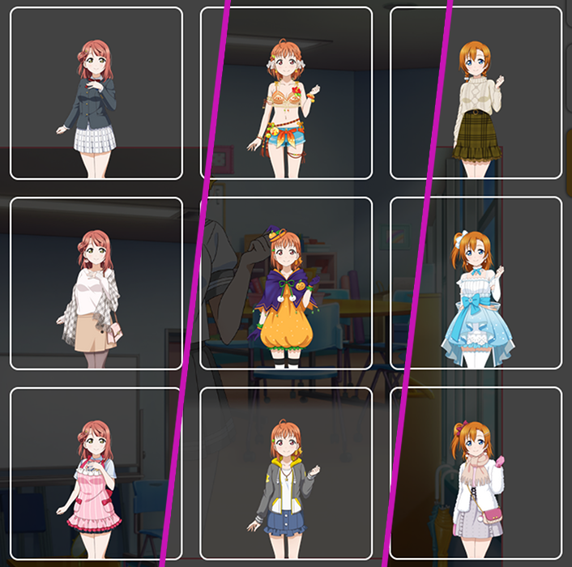
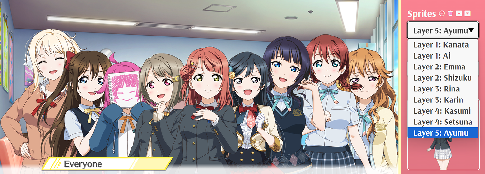
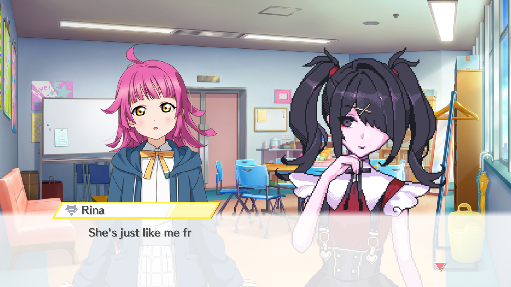

# School Idol Festival: All Stars Dialogue Sandbox
A Dialogue Sandbox for generating fan-made stories from the now-shut down game, [Love Live! School Idol Festival All Stars](https://lovelive-as-global.com/)



## Features
### Choose the Background
Choose from more than 500 backgrounds found in SIFAS.



Or if you want a custom background, you can upload your own!



### Change the Text and customize the Name Tag
Change the color of the name tag and the name while you create your story.



### More Sprites to use
Pick a sprite available for the characters you choose...



... and give them another chapter!



or introduce new characters to your own story.

[](https://github.com/lezzthanthree/Needy-Streamer-Overload/)

## Developing
### Prerequisites
Make sure you have [Node.JS](https://nodejs.org/en) and [npm](https://www.npmjs.com/) in your system. Install them first before proceeding.  

### Running the app
Install the required libraries.
```
npm install
```
Once done, you can start the application
```
npm run dev
```

## Report an issue
If you think there's a problem on using the sandbox, please submit a report by opening an issue on the [issues](https://github.com/lezzthanthree/SIFAS-Dialogue-Sandbox/issues) tab.

## Special Thanks

### The Localization Contributors
A huge thanks to our translators!
- **Spanish Team**: [SantosAlarcon](https://github.com/SantosAlarcon)
- **Japanese Team**: [canaria3406](https://github.com/canaria3406)
- **Chinese Team**: [canaria3406](https://github.com/canaria3406)

### Love Live Hax
- [LLAS Decryptor](https://github.com/nosyrbllewe/LLASDecryptor) by [nosyrbllewe](https://github.com/nosyrbllewe/)

## Relevant Links
- [Love Live SIF Waifu Simulator](https://llsif-waifu-sim.github.io/) by [u/vanstorm9](https://llsif-waifu-sim.github.io/)
- [Custom Beatmap Festival](https://www.reddit.com/r/CustomBeatmapFestival/) by [u/SovietSpartan](https://www.reddit.com/r/SchoolIdolFestival/comments/54uyaz/fan_made_custom_beatmap_festival_beatmap/)
- [SIFAS Daily Theater Maker](https://twy.name/LLAS/mainichi/) by [@twy____](https://twitter.com/twy____)
- [Project Sekai Stickers](https://st.ayaka.one/) by [TheOriginalAyaka](https://github.com/TheOriginalAyaka/sekai-stickers)

## Disclaimer
All assets used for this project are owned by KLabGames/Sunrise/Bushiroad and will be used for non-commercial purposes.

No copyright infringement is intended.

### Why is it called sandbox?
idk, it sounds better

---
[](https://www.youtube.com/c/SmiliePop)[](https://reddit.com/user/lezzthanthree)